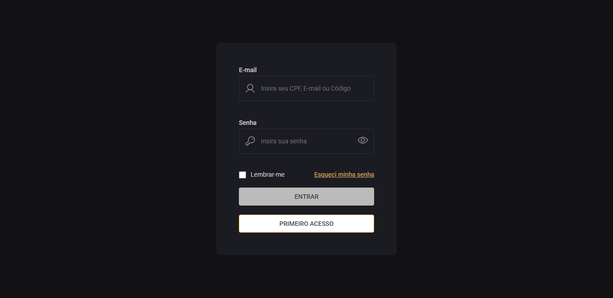

<h3 align="center"> Página de login </h3>

Foi utilizado estado para exibir/ocultar senha, conforme o usuário clica no ícone dentro no input password. Além disso, o botão de "entrar", só é habilitando há conteúdo dentro do inout email e no input senha.

  

